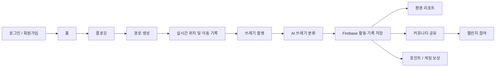

# 🌱 Re:Boot

> **플로깅을 기록하고, AI로 쓰레기를 분류하며, 게임과 커뮤니티를 통해 환경 활동을 지속하도록 돕는 모바일 애플리케이션**

Re:Boot는 사용자의 플로깅 활동을 단순히 기록하는 데서 끝나지 않고,  
**경로 기록 → 쓰레기 촬영 및 AI 분류 → 환경 기여도 확인 → 커뮤니티 공유 → 게임 보상**으로 이어지는 경험을 제공합니다.

<br>

## 📌 프로젝트 소개

플로깅은 조깅이나 산책을 하면서 주변의 쓰레기를 줍는 환경 활동입니다.  
하지만 일회성 활동으로 끝나기 쉽고, 사용자가 자신의 환경 기여도를 체감하거나 지속적인 참여 동기를 얻기 어렵다는 문제가 있습니다.

Re:Boot는 이러한 문제를 해결하기 위해 다음 기능을 하나의 앱에 통합했습니다.

- 사용자의 위치를 기반으로 한 **플로깅 경로 생성 및 실시간 이동 기록**
- 촬영한 쓰레기 이미지를 분석하는 **AI 쓰레기 분류**
- 수집 데이터를 활용한 **CO₂ 절감량 및 AI 환경 리포트**
- 플로깅 기록을 공유하는 **커뮤니티와 지역·인기 게시글**
- 함께 목표를 달성하는 **플로깅 챌린지**
- 활동 보상을 활용한 **펫 성장, 미니게임, 아이템 구매 시스템**

<br>

## 📱 주요 기능

### 1. 회원 관리

- Firebase Authentication 기반 이메일 로그인 및 회원가입
- Google 계정 로그인 지원
- SharedPreferences를 활용한 자동 로그인
- Firebase Realtime Database에 사용자 프로필 및 활동 정보 저장

### 2. 플로깅 경로 생성 및 실시간 기록

- Google Maps 기반 현재 위치 표시
- 거리 조건을 전달해 외부 Route API에서 플로깅 경로 생성
- 반환된 Encoded Polyline을 디코딩해 지도에 경로 표시
- GPS 위치 변화를 기반으로 실제 이동 경로 실시간 기록
- 이동 거리, 운동 시간, 평균 속도 계산
- 활동 종료 후 경로와 세션 기록을 Firebase에 저장

### 3. AI 쓰레기 분류

- 플로깅 중 카메라를 이용해 쓰레기 촬영
- 촬영 이미지를 AI 분류 API에 전송
- 예측 결과를 기반으로 쓰레기 카테고리 자동 선택
- 사용자가 분류 결과를 직접 수정·확정 가능
- 이미지, 쓰레기 종류, 위치 및 실제 주소를 Firebase에 저장

### 4. 환경 리포트

- 사용자가 수집한 쓰레기 종류와 개수를 일별·누적으로 집계
- 쓰레기 종류별 환산값을 이용해 CO₂ 절감량 계산
- 수집 지역과 활동 데이터를 기반으로 AI 환경 코멘트 생성
- 막대그래프를 통해 쓰레기 수거 현황 시각화

### 5. 커뮤니티

- 플로깅 후기 및 이미지 게시글 작성
- 기존에 저장한 플로깅 경로를 게시글에 첨부
- 전체 / 인기 / 지역별 게시글 조회
- 댓글 기반 사용자 소통
- Firebase Storage를 이용한 게시글 이미지 저장

### 6. 플로깅 챌린지

- 목표 거리, 지역, 참여 인원 등을 설정해 챌린지 생성
- 다른 사용자가 챌린지에 참여
- Firebase Realtime Database를 통한 참여 현황 및 진행 상태 공유

### 7. 게임 및 보상

- 플로깅 활동과 연계된 포인트 시스템
- 미니게임 플레이를 통한 코인 획득
- 게임 성과에 따른 펫 상태 및 성장 단계 변화
- 코인을 플로깅 포인트로 교환
- 코인을 사용해 게임 아이템 구매

<br>

## 🔄 서비스 흐름



<br>

## 🏗️ 시스템 아키텍처

<p align="center">
  
</p>

<br>

## 🛠️ 기술 스택

| 분류 | 기술 |
| --- | --- |
| **Client** | Flutter, Dart |
| **State Management** | Provider |
| **Authentication** | Firebase Authentication, Google Sign-In |
| **Database** | Firebase Realtime Database |
| **Storage** | Firebase Storage |
| **Map / Location** | Google Maps Flutter, Location, Geolocator, Geocoding |
| **Route** | Flutter Polyline Points, HTTP REST API |
| **AI Integration** | HTTP Multipart API, Firebase Functions / Cloud Run |
| **Visualization** | fl_chart |
| **Local Storage** | SharedPreferences |

<br>

## 📂 프로젝트 구조

```text
capstonedesign/
├── lib/
│   ├── Camera/                 # 쓰레기 촬영, AI 분류 및 이미지 저장
│   ├── Firebase/               # Firebase 설정 및 활동 기록 서비스
│   ├── Game/                   # 펫 성장, 미니게임, 코인 및 상점
│   ├── Homepage/
│   │   ├── Community/          # 게시글, 댓글, 지역/인기 글, 챌린지
│   │   ├── Environment/        # 환경 리포트 및 CO₂ 절감량 시각화
│   │   ├── Flogging/           # 경로 생성, 위치 추적, 플로깅 기록
│   │   └── Mypage/             # 사용자 활동 및 마이페이지
│   ├── Userinfo/               # 로그인, 회원가입, 계정 관련 기능
│   ├── common/                 # 공통 유틸리티
│   ├── services/               # 외부 API 연동
│   ├── widgets/                # 공통 위젯
│   └── main.dart               # 앱 진입점
├── assets/
│   └── images/                 # 앱 UI 및 게임 리소스
├── android/
├── ios/
├── web/
└── pubspec.yaml
```

<br>

## 🗄️ 주요 데이터 구조

Firebase Realtime Database를 중심으로 사용자별 플로깅 데이터와 서비스 상태를 관리합니다.

```text
users/{uid}
├── workoutStats           # 누적 거리, 시간, 평균 속도, 세션 수
├── polylineHistory        # 플로깅 세션 및 저장 경로
├── navigatorHistory       # 네비게이션 기반 이동 기록
├── ploggingRecords        # 촬영한 쓰레기 종류 및 위치 정보
├── ploggingPoints         # 플로깅 포인트
├── coins                  # 게임 코인
├── purchasedItems         # 구매 아이템
└── pet                    # 펫 상태 및 성장 정보

community_posts            # 커뮤니티 게시글
commentsDetail             # 게시글 댓글
challenges                 # 플로깅 챌린지
ads                        # 커뮤니티 광고 데이터
```

<br>

## ✨ 핵심 구현

### GPS 기반 실시간 플로깅 기록

위치 업데이트를 구독해 사용자의 이동 좌표를 지속적으로 수집하고,  
좌표 사이 거리를 계산해 총 이동 거리를 누적합니다.

활동 종료 시에는 거리, 시간, 평균 속도와 선택적으로 Encoded Polyline을 Firebase에 저장합니다.

### 플로깅 경로 재사용

저장된 Encoded Polyline은 이후 다시 디코딩할 수 있도록 관리합니다.

이를 통해 과거 플로깅 경로를 지도에 표시하거나  
커뮤니티 게시글에 경로 정보와 함께 공유할 수 있습니다.

### AI 기반 쓰레기 기록 자동화

카메라로 촬영한 이미지를 Multipart 형식으로 분류 API에 전송하고,  
반환된 예측 결과를 앱의 쓰레기 카테고리와 매핑합니다.

AI가 먼저 분류한 뒤 사용자가 결과를 확인·수정하도록 구성해  
자동화와 사용자 검증을 함께 적용했습니다.

### 활동 데이터를 서비스 전반의 보상으로 연결

플로깅 기록을 단순 운동 데이터로만 저장하지 않고  
포인트, 게임, 펫 성장, 커뮤니티, 환경 리포트와 연결했습니다.

이를 통해 실제 환경 활동이 앱 내부의 지속적인 사용자 경험으로 이어지도록 구성했습니다.

<br>

## 🖼️ 화면

<p align="center">
  
  &nbsp;&nbsp;
  
</p>

<br>

## 🚀 실행 방법

### 1. 저장소 Clone

```bash
git clone https://github.com/MuHaRVEY/CBNU_Capstone_Design_2025_ReBoot.git
cd CBNU_Capstone_Design_2025_ReBoot/capstonedesign
```

### 2. Flutter 패키지 설치

```bash
flutter pub get
```

### 3. Firebase / Google Maps 설정

프로젝트 실행을 위해 다음 서비스 설정이 필요합니다.

- Firebase Authentication
- Firebase Realtime Database
- Firebase Storage
- Google Sign-In
- Google Maps SDK

운영 또는 별도 개발 환경에서 사용할 경우 Firebase 설정 파일과 API Key를 각자의 환경에 맞게 구성해야 합니다.

### 4. 앱 실행

```bash
flutter run
```

<br>

## 🔐 보안 관련 참고

현재 저장소에는 Firebase 및 지도 서비스 설정값이 포함될 수 있습니다.

실제 운영 환경에서는 다음 사항을 함께 적용하는 것을 권장합니다.

- Google Maps API Key의 Android / iOS 애플리케이션 제한 설정
- Firebase Security Rules를 통한 사용자별 데이터 접근 제한
- 외부 API 호출에 필요한 민감한 인증 정보는 클라이언트 코드에 직접 포함하지 않고 서버 환경 변수 또는 Secret Manager에서 관리

<br>

## 📌 향후 개선 사항

- 플로깅 기록 및 커뮤니티 데이터 모델 구조 정리
- 네트워크 오류 및 외부 API 장애에 대한 재시도 / 예외 처리 강화
- AI 분류 결과에 대한 사용자 피드백 데이터 축적
- 환경 활동 통계 및 사용자별 장기 추세 시각화 확대
- 테스트 코드 및 CI/CD 파이프라인 추가

<br>

## 📄 License

본 프로젝트는 충북대학교 Capstone Design 프로젝트로 제작되었습니다.
